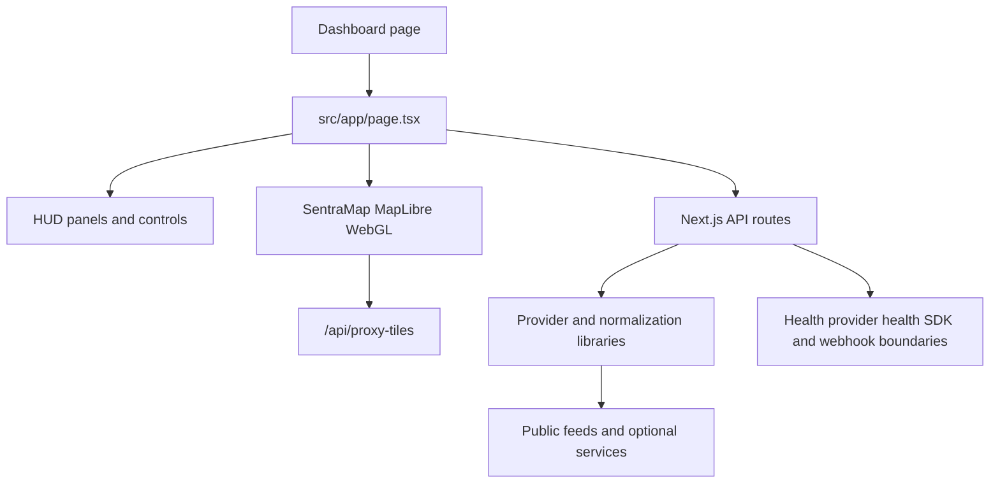

# Runtime architecture

Sentra Mi8 is a single-page client dashboard backed by Next.js App Router route handlers. The browser owns interaction state and renders normalized entities; server routes are the integration boundary to public feeds and optional services. This separation is visible in `src/app/page.tsx`, `src/components/SentraMap.tsx`, `src/app/api/`, and `src/lib/`.

Caption: The client shell coordinates visualization and fetches while route handlers and libraries isolate external data sources.

## Client shell and map boundary

`page.tsx` is a client component. It dynamically loads the browser-dependent map and several large panels, including `SentraMap`, `LayerPanel`, `CameraViewer`, `OsintPanel`, and `EntityGraphPanel`. It keeps mutable feed data in `dataRef`, tracks a `dataVersion`, and exposes state for map view, active layers, theme, panels, streams, alerts, and entity intelligence.

`SentraMap.tsx` initializes MapLibre without SSR, creates empty GeoJSON sources for major entity classes, and renders those sources as GPU-backed map layers. Basemap requests are routed through `/api/proxy-tiles`. The map reports entity clicks and view changes back to the shell; it does not own provider fetching.

## State and navigation

The shell starts at the default globe view in `page.tsx` and parses `lat`, `lon`, `zoom`, and `layers` from the URL. Changes are written with a debounced `history.replaceState`, making a shared URL a lightweight view preset. Theme state supports `core` and `ghost` modes; recent history (`97fa47d`) specifically introduced dynamic aviation colors and military red behavior for Ghost mode.

The shell also branches map interactions into higher-level workflows: aircraft clicks can open live aircraft intelligence, CCTV entities open camera playback, stream entities open `LiveStreamPlayer`, and map context actions request a region dossier.

## Map rendering and UI boundary

The map is a visualization surface, not a DOM list. `LayerPanel` controls visibility and activation; the shell decides when data is fetched; `SentraMap` receives data and layer state and updates sources/layers. This keeps thousands of points in WebGL while panels handle detailed inspection and actions.

## Server-side route boundary

Routes under `src/app/api` are intentionally heterogeneous. Common patterns are:

1. Parse and validate query/body input.
2. Apply route-local authentication, rate limiting, or SSRF protection where the operation is active or sensitive.
3. Call a provider module or external endpoint.
4. Normalize the response into the shape expected by the client.
5. Return JSON, cache headers, or a controlled error.

The route boundary is not centrally protected by middleware: `src/middleware.ts` excludes `/api` from its matcher. Therefore changes to scanner, OSINT, SDK, webhook, proxy, or AI routes must inspect their own security controls.

Provider configuration passes through a small runtime layer rather than raw environment reads. `src/lib/provider-config.ts` merges a gitignored overlay file over `process.env`; provider-backed routes should call `getProviderEnv()` so credentials set through the admin surface apply without a restart. The admin routes under `src/app/api/admin/` are a distinct, deliberately password-less boundary guarded by `src/lib/admin-guard.ts` (feature flag, loopback-only Host, cross-origin refusal, custom write header) — never expose them on a network-reachable deployment.

## Why the architecture evolved this way

The history shows a progression from map and feed aggregation toward operationally explicit provider boundaries and entity workflows. `bae9f8f` established the local Sentra Mi8 foundation and provider health; `db01742` added aircraft intelligence and photo lookup. The practical consequence is that new capabilities should usually add a focused provider/normalizer and route, then wire the result into the shell and map click path rather than embedding external calls directly in UI components.

See the [data-loading workflows](../workflows/data-loading.md) for request timing and cache behavior, and the [source map](../source-map.md) for ownership by directory.
