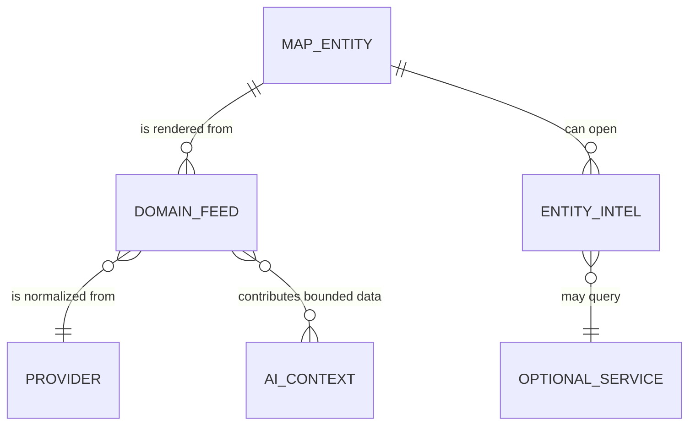

# Intelligence surface

Sentra Mi8 presents many data domains through one map and a set of inspection panels. The map is the shared spatial index; panels provide deeper context and actions. The main domain list comes from `README.md`, while actual activation and rendering are coordinated by `src/app/page.tsx` and `LayerPanel.tsx`.

## Major domains

- **Aviation:** live aircraft points, category classification, GPS-jamming indicators, and click-through aircraft intelligence. Start with `src/lib/flight-providers.ts`, `/api/flights`, `aircraft-intel.ts`, and `aircraft-photo.ts`.
- **Maritime:** static ports/chokepoints/naval intelligence plus optional live AIS. Start with `/api/maritime` and `src/lib/ais.ts`.
- **CCTV and live media:** provider-specific camera records, stream status, HLS/video/iframe classification, and external IPTV country/channel lists. Traffic-authority feeds (TfL, Caltrans, Canadian 511s, ASFINAG, FDOT FL511, NYSDOT 511NY, and more) resolve by viewport region. FDOT FL511 cameras show a still first, then play live DIVAS HLS in the first-party `CameraViewer` on demand: `/api/cctv/fl511-live` mints a token and `/api/cctv/fl511-hls` proxies the origin-locked playlist so the browser stays same-origin. NYSDOT 511NY (`ny511.ts`) is the same Castle Rock list platform but its Skyline/skyvdn HLS is unauthenticated and CORS-open, so it plays directly in the viewer with no token or proxy. Start with `CameraViewer.tsx`, `LiveStreamPlayer.tsx`, `/api/cctv` (and its per-region modules such as `fl511.ts`), and `/api/iptv`.
- **Worldwide cameras:** a viewport-scoped merge of keyless OpenStreetMap surveillance *positions* and optional Windy *webcams*, presented in a rounded browser UI. A `kind` field separates mapped positions from watchable feeds. Start with `CameraBrowser.tsx`, `/api/cameras/worldwide`, and `src/lib/cameras/`.
- **Subsea cables:** TeleGeography cable geometry with derived lifecycle status (operational, under construction, planned) and an animated traffic-flow overlay. Start with `src/lib/submarine-cables.ts`, `/api/cables`, and the `cables-*` layers in `SentraMap.tsx`.
- **Environment and space:** earthquakes, fires, severe weather, satellites, and space weather. These are mostly public-feed, keyless map layers.
- **News and conflict:** live broadcasters, news intelligence, GDELT, Telegram public-preview posts, frontlines, and region dossiers. Read `/api/news`, `/api/live-news`, `/api/gdelt`, and `/api/region-dossier` together with the shell’s layer mapping.
- **Cyber and RECON:** DNS, WHOIS, IP intelligence, CVE/threat lookup, malware, sweep, and scanner operations. These are active or sensitive operations and require route-specific validation, rate limits, SSRF controls, or optional scanner configuration.
- **Entity intelligence:** entity graph expansion and aircraft details turn a map point into a deeper investigation. `EntityGraphPanel.tsx` is the principal UI; `/api/entity/expand` and optional `SENTRA_MI8_INTEL_URL` define the service boundary.
- **AI analyst:** `/api/ai/analyze` and `/api/ai/briefing` use bounded structured context and optional Gemini keys. AI output is an analysis layer over feed data, not an independent source of truth.
- **Markets and supply chain:** `MarketsPanel.tsx`, `ScmPanel.tsx`, and their routes expose non-map operational context alongside spatial intelligence.

## Entity-level aircraft path

The recent aircraft feature is a meaningful product shift. A flight first appears as a normalized map entity, then a click can request aircraft metadata and imagery and populate the entity graph/intel panel. This path crosses the [data-loading workflow](../workflows/data-loading.md#aviation-as-a-reference-workflow), `SentraMap.tsx`, `page.tsx`, `aircraft-intel.ts`, `aircraft-photo.ts`, and the panel added/expanded by commit `db01742`.

## Domain relationships

Caption: Feed entities are normalized from providers, may open deeper intelligence, and can contribute bounded context to AI analysis.

The entities are intentionally conceptual rather than database tables: the repository has no shared persistence model for these map domains. The concrete shapes live near each provider, with aviation currently the clearest typed example.

## Investigator safety and interpretation

Static intelligence, public feeds, and AI correlations have different provenance and freshness. The UI aggregates them for situational awareness; it should not imply that a marker is independently verified. When adding a domain, preserve source attribution, timestamps, fallback state, and controlled failure behavior in the response so the UI can communicate uncertainty.
