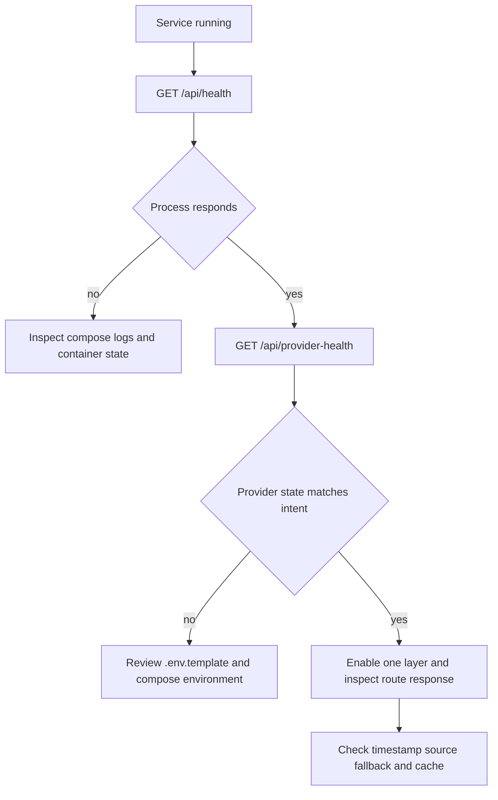

# Operations runbook

## Recommended local deployment

For a laptop-local build without the auxiliary stack:

```bash
cp .env.template .env
docker compose -f docker-compose.local.yml up -d --build
curl -fsS http://localhost:3005/api/health
curl -fsS http://localhost:3005/api/provider-health
```

`docker-compose.local.yml` names the container `sentra-mi8-local`, publishes host port 3005 by default, and maps it to the application’s container port 3000. Set `LOCAL_SENTRA_MI8_PORT` to change only the host port. The full `docker-compose.yml` adds the broader self-hosting/CasaOS topology, including nginx tile caching and the auxiliary intel service; use it when those services are actually required.

The `Dockerfile` builds a Next standalone application on Node 22 Alpine, runs as non-root user `nextjs` with UID 1001, and starts `node server.js` on port 3000. The compose files inject `.env` only when present, so the keyless core can boot without it.

## Health checks and diagnosis



Caption: Start with process health, then redacted configuration state, then isolate the affected layer and provider.

`/api/health` reports platform, version, uptime, timestamp, and representative endpoints. It does not actively probe external providers. `/api/provider-health` reports configuration classification and route ownership, not provider latency or reachability. For a missing layer, check in order:

1. The relevant layer is enabled and its URL state is valid.
2. Provider health says the expected credential/configuration is present.
3. The route response timestamp and source/fallback fields are plausible.
4. Docker logs show whether upstream fetches timed out or returned empty data.
5. The route’s in-memory cache has not preserved a stale process-local result.

## Operational caveats

- Process-local caches and state reset on restart. AIS and SDK entities require a persistent process and are not durable storage.
- In-memory rate limits are per instance. Scaling horizontally changes enforcement semantics.
- The API is excluded from analytics middleware. Route-specific auth and abuse controls must remain in the route.
- The scanner and other active OSINT operations should be treated as sensitive. Preserve SSRF validation, target restrictions, and rate limiting when changing them.
- Umami configuration sends an IP-derived network event. Confirm privacy, retention, and proxy-header trust before enabling it in a deployment.

For complete variable meanings, see [provider integrations](../integrations/providers.md). For validation commands and the current runtime limitation, see [testing guidance](../testing/guidance.md).
