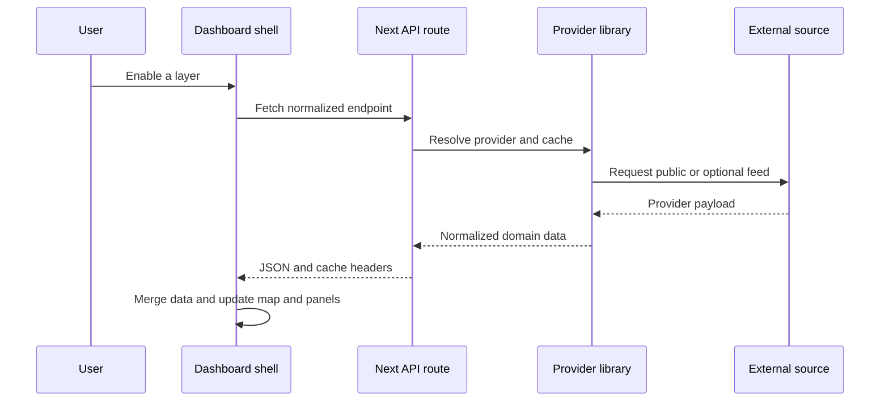

# Data loading and normalization

The dashboard intentionally avoids fetching every feed at startup. `src/app/page.tsx` starts a small core set, loads optional feeds when layers are activated, and polls active domains on relaxed intervals. `layerFetchedRef` prevents duplicate first fetches; `fetchEndpoint` skips work while the document is hidden, uses `no-store` browser requests, merges results into `dataRef`, and records backend status.

Caption: Layer activation drives a route request, provider normalization, and client-side map/panel refresh.

## Core and optional scheduling

The shell fetches earthquakes and news immediately, then markets and space weather with short startup delays. It polls core feeds at approximately 15–30 minute intervals. Optional requests are conditional on layer state: aviation, satellites, fires, CCTV, maritime, live news, weather, infrastructure, GDELT, cables, malware, and other specialized layers are not all loaded by default. This is the implementation behind the README’s progressive-loading and edge-request reduction claims.

When changing a polling interval, inspect both the initial activation effect and the later active-layer polling effect. A route may be called from more than one scheduling branch.

## Aviation as a reference workflow

`/api/flights` is a useful model for provider-backed data:

- `src/lib/flight-providers.ts` defines the canonical `FlightFeedData` and `AircraftRecord` shapes.
- OpenSky OAuth is the primary global source when both `OPENSKY_CLIENT_ID` and `OPENSKY_CLIENT_SECRET` are present, because it has the widest coverage. OpenSky publishes no aircraft type code or registration, so on its own almost every record classifies as commercial.
- adsb.lol enrichment therefore runs alongside it: a hex-keyed index built from the six broad regional queries plus the worldwide military feed supplies type code, registration, the military bit, and navigation accuracy, joined onto OpenSky records by ICAO hex. `classifyByTypeCode` is shared by both paths so classification is consistent. Enrichment is best-effort — losing it costs metadata and category precision, never coverage.
- If OpenSky is unconfigured, empty, rate-limited, or times out, the adapter falls back to adsb.lol alone.
- The map renders the full set (GPU symbol layers); do not decimate flight features before rendering.
- The route keeps a module-level cache and shared in-flight promise. Normal feeds receive `s-maxage=90` and stale-while-revalidate headers; sparse feeds use `no-store` to avoid caching an apparent outage.
- Aircraft clicks in the shell convert normalized properties into the entity-intelligence workflow added in `db01742`.

Two receiver-coverage realities are worth recording: OpenSky and adsb.lol both aggregate terrestrial ADS-B receivers, so mid-ocean aircraft are genuinely sparse regardless of code, and AIS receivers are predominantly coastal, so open-ocean vessels are thinner than coastal traffic. These are data limitations, not bugs.

This provider layering is described by [provider integrations](../integrations/providers.md) and surfaced in the [intelligence surface](../domains/intelligence-surface.md).

## Other stateful workflows

Maritime combines static ports, chokepoints, and naval intelligence with optional AISStream WebSocket updates. AIS messages are normalized, merged into process-global state, stale-pruned after about ten minutes, and capped at 20,000 ships. SDK ingest similarly stores normalized entities in process memory and publishes updates through `/api/sdk/stream` SSE. These are persistent-process workflows, not durable databases.

IPTV routes normalize country codes and channel records and expose cache/stale metadata. AI routes serialize bounded context from feeds such as news, earthquakes, threats, and cyber data before sending it to Gemini. The UI should consume these normalized responses rather than calling providers directly.

Two newer workflows are viewport-scoped rather than global. `/api/cameras/worldwide` requires a `bbox` and merges OpenStreetMap surveillance positions (Overpass, refused above a maximum area so an unbounded query cannot time out) with optional Windy webcams; the shell derives the bbox from the current map view. `/api/cables` fetches TeleGeography cable geometry plus per-cable detail, derives lifecycle status, and caches for 24h; `SentraMap.tsx` animates the traffic-flow overlay by stepping `line-dasharray` on a timer only while the layer is visible.

When a credential changes through the provider-admin surface, `src/lib/cache-registry.ts` clears the credential-dependent module caches (for example the OpenSky token cache and the flights/cables response caches) so the new key takes effect without a restart.

## Caching and failure semantics

There are multiple cache layers: module-level route caches, shared in-flight promises, provider token caches, browser `no-store` fetches, and HTTP response cache headers. A successful response can therefore be fresh at the provider boundary but stale in the browser or reverse proxy. A failed or sparse feed may intentionally be returned uncached.

Most caches are instance-local. Restarting the process clears them, and multiple workers do not share them. When debugging “missing” data, inspect provider health, route logs, response timestamps, layer activation, and whether the request hit a different process before changing normalization code.
